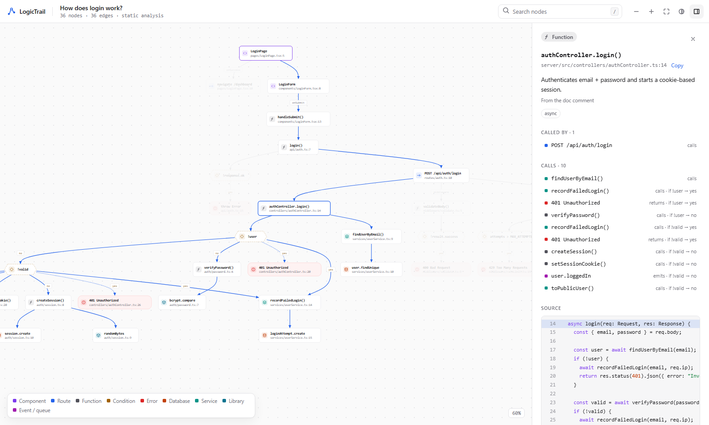
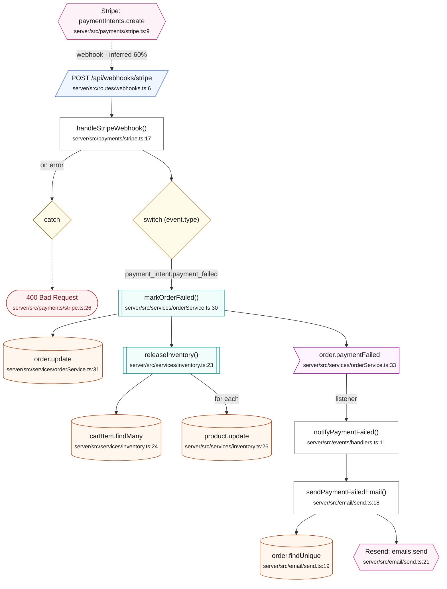
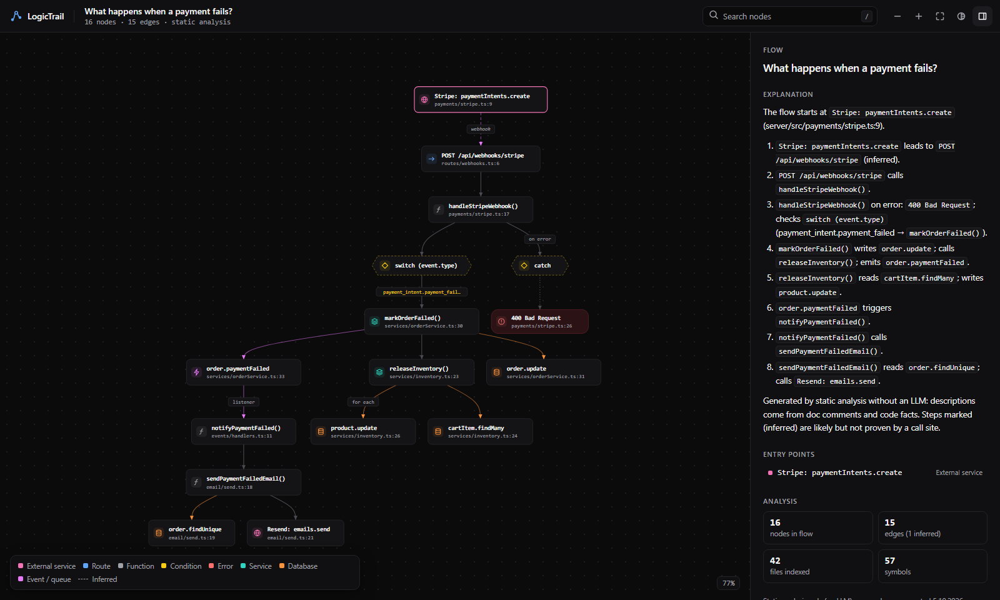
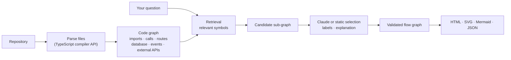

<p align="center">
  
</p>

<h1 align="center">LogicTrail</h1>

<p align="center"><strong>Ask your codebase how it works.</strong></p>

```bash
npx logictrail "how does checkout work?"
```

LogicTrail turns your code into an interactive execution flow. Ask about a feature in plain
English and get the path the code actually takes (components, API routes, services, database
calls, events, external APIs and the branches between them), with the file and line behind every
step.



<p align="center">
  <a href="docs/examples/login.html">Download the example viewer</a> ·
  <a href="docs/examples/login.svg">SVG</a> ·
  <a href="docs/examples/login.mmd">Mermaid</a> ·
  <a href="docs/examples/login.json">JSON</a>
</p>

It is not a dependency visualizer. LogicTrail answers one question at a time and draws only the
code that answers it.

## Demo

`npx logictrail "what happens when a payment fails?"` on the [sample app](examples/acme-shop)
produces this Mermaid diagram (rendered here by GitHub), next to an interactive HTML viewer:



Every solid edge comes from a call site in the code. The Stripe → webhook edge is dashed and
labelled as inferred because no call site proves it: Stripe calls the webhook from outside the
codebase.

<details>
<summary>The same flow in the interactive viewer (dark theme)</summary>



</details>

## Installation

LogicTrail needs Node.js 22 or newer. Run it without installing:

```bash
npx logictrail "how does authentication work?"
```

Or add it to a project:

```bash
npm install --save-dev logictrail
```

## Quickstart

```bash
cd your-project
npx logictrail "what happens after a user logs in?" --open
```

This indexes the repository, finds the flow, writes `.logictrail/what-happens-after-a-user-logs-in.html`
and opens it in your browser.

LogicTrail works without any API key: static analysis selects the flow and writes the
explanation from code facts and doc comments. For better selection, descriptions and
explanations, add Claude:

```bash
export ANTHROPIC_API_KEY=sk-ant-...
npx logictrail "how does checkout work?"
```

Add `.logictrail/` to your `.gitignore` unless you want to commit generated flows. The cache
folder ignores itself.

### In Claude Code

The [LogicTrail plugin](claude-plugin) adds `/logictrail:explain`: Claude runs LogicTrail, reads the flow and walks
you through it with the file and line behind every step. `/logictrail:update` re-runs saved flows against the
current code and explains what changed.

```text
/plugin marketplace add werlen-nevio/LogicTrail
/plugin install logictrail@logictrail
/logictrail:explain how does checkout work?
/logictrail:update checkout
```

## How it works



1. **Index.** Every JS/TS file is parsed once into language-neutral _facts_: imports, exports,
   functions, classes, calls in order, branches, error exits, routes, listeners and pages. Facts
   are cached by content hash, so only changed files are parsed again.
2. **Resolve.** A code graph connects the facts across files. It follows imports, re-exports,
   `tsconfig` paths, object members, class instances and injected constructor properties.
   Framework adapters classify calls into Prisma, Drizzle, Stripe, `fetch` and so on, and client
   requests are matched to server routes.
3. **Retrieve.** Your question becomes search terms ("logs in" → `login`, plus synonyms), and the
   best-matching symbols seed a bounded sub-graph: callers up to an entry point, callees down to
   the side effects.
4. **Select.** Claude receives only that sub-graph with excerpts of the most relevant code, never
   the whole repository. It chooses the nodes that answer the question, describes them, writes
   the explanation and may propose relationships static analysis missed. Without an API key, a
   deterministic provider does the selection instead.
5. **Validate.** Anything the model returns that static analysis did not find is dropped. Proposed
   relationships are kept only between real nodes, and are marked `source: "inferred"` with a
   confidence and a reason.
6. **Render.** Branches inside functions become condition, error and response nodes. The graph is
   laid out once and rendered as HTML, SVG, Mermaid and JSON.

### Evidence

Every node carries its definition (`file`, `line`, source excerpt). Every static edge carries the
call site that proves it:

```json
{
  "from": "server/src/controllers/authController.ts#authController.login",
  "to": "server/src/services/userService.ts#findUserByEmail",
  "type": "calls",
  "confidence": 1,
  "source": "static",
  "evidence": [
    {
      "file": "server/src/controllers/authController.ts",
      "line": 17,
      "kind": "call",
      "text": "const user = await findUserByEmail(email);"
    }
  ]
}
```

Relationships that are likely but unproven say so:

```json
{
  "type": "triggers",
  "label": "webhook",
  "confidence": 0.6,
  "source": "inferred",
  "reason": "Stripe delivers webhook events to POST /api/webhooks/stripe, whose handler processes Stripe webhooks."
}
```

### What is sent to Claude

The question, the candidate nodes (names, file paths, signatures, doc comments), the edges
between them, and source excerpts of the most relevant functions (about 60k characters at most).
Use `--model static` to keep everything on your machine.

## Output formats

| Format  | Flag               | What you get                                                                                                 |
| ------- | ------------------ | ------------------------------------------------------------------------------------------------------------ |
| HTML    | `--output html`    | A single offline file: pan, zoom, search, node details, source, evidence, dark and light themes, deep links. |
| SVG     | `--output svg`     | A standalone image with light and dark styles (`--theme light\|dark\|auto`).                                 |
| Mermaid | `--output mermaid` | A `flowchart` for GitHub, GitLab, Notion and docs.                                                           |
| JSON    | `--output json`    | The full graph model, with evidence and snippets.                                                            |

Combine formats with commas (`--output html,mermaid`) or use `--output all`. Add `--stdout` to
print a single format instead of writing a file:

```bash
npx logictrail "how does checkout work?" --output mermaid --stdout >> docs/checkout.md
```

### The HTML viewer

- Click a node to see its description, location, callers and callees (branch-aware), its source
  with the line highlighted, its evidence and its metadata.
- The whole trail through the selected node is highlighted, and everything else is dimmed.
- Click an edge to see why it exists: the call site, or the reason it is inferred.
- `/` searches, `F` fits the graph to the screen, `+`/`-` zoom, `↑`/`↓` step through the flow,
  `T` switches the theme and `Esc` clears the selection.
- Links like `flow.html#node=<id>` open with a node selected. "Open in editor" jumps to the line
  in VS Code.

## Examples

```bash
logictrail "how does checkout work?"
logictrail "what happens after a user logs in?"
logictrail "what happens when a payment fails?"
logictrail "create customer flow"

logictrail --function createSession            # start at a function, method or component
logictrail --route "POST /api/orders"          # start at an HTTP route, including its callers
logictrail --file src/auth/login.ts            # start at the entry points of a file

logictrail "how does checkout work?" --output html --open
logictrail "how are invoices generated?" --model static --max-depth 8
```

Try them on the bundled sample: `npx logictrail "how does checkout work?" --root examples/acme-shop`.

### CLI options

| Option                | Description                                                                   |
| --------------------- | ----------------------------------------------------------------------------- |
| `-o, --output <list>` | `html`, `svg`, `mermaid`, `json` or `all` (default: `html`)                   |
| `--open`              | Open the result in your browser                                               |
| `-m, --model <model>` | `claude`, a Claude model id such as `claude-opus-5-5`, or `static` for no LLM |
| `--max-depth <n>`     | Hops to follow from the relevant code (default: 12)                           |
| `--max-nodes <n>`     | Upper bound on nodes in the flow (default: 60)                                |
| `--file <path>`       | Explain the flow starting in a file                                           |
| `--function <name>`   | Explain the flow starting at a function, method or component                  |
| `--route <route>`     | Explain the flow behind a route, e.g. `"POST /api/orders"`                    |
| `--root <dir>`        | Repository root (default: current directory)                                  |
| `--out-dir <dir>`     | Output directory (default: `.logictrail`)                                     |
| `--name <name>`       | Output file name                                                              |
| `--theme <theme>`     | SVG theme: `auto`, `light` or `dark`                                          |
| `--stdout`            | Print one format to stdout instead of writing files                           |
| `--no-cache`          | Re-parse every file                                                           |
| `--config <path>`     | Use a specific config file                                                    |
| `-v, --verbose`       | Show seeds, skipped files and validation details                              |

### Updating flows

A flow shows the code as it was when you asked. After the code changes, run it again with the
same question or starting point and limits:

```bash
npx logictrail update                          # every flow in .logictrail
npx logictrail update how-does-checkout-work   # one flow, by its file name
```

LogicTrail rewrites each flow in the formats it was saved in (an SVG keeps its theme) and lists
what changed:

```text
✓ what-happens-when-a-payment-fails: steps 1 added, 3 moved; edges 1 added
  + paymentAttempt.create (database) server/src/services/orderService.ts:35
  ~ markOrderFailed()  server/src/services/orderService.ts:30 → :32
```

`+` and `−` mark steps that are new or gone, `~` a step that moved. Lines with an arrow
(`− sendPaymentFailedEmail() → Resend: emails.send (calls)`) are connections gained or lost
between steps that are in both versions.

`update` reads a flow's `.json` file, or its `.html` viewer when there is no JSON, and takes
`--root`, `--out-dir`, `--model`, `--max-depth`, `--max-nodes`, `--theme`, `--open`, `--no-cache`
and `--config`. To ask a question that starts with the word "update", put it in quotes.

## Configuration

Create `logictrail.config.ts` (or `.js`, `.mjs`, `.json`) in the repository root:

```ts
import type { LogicTrailConfig } from "logictrail";

export default {
  ignore: ["tests/**", "generated/**"],
  maxDepth: 10,
  maxNodes: 60,
  outputDir: ".logictrail",
  output: ["html", "mermaid"],
  llm: {
    model: "claude-opus-5-5", // or "claude", "static", "auto" (default)
    effort: "medium",
  },
} satisfies LogicTrailConfig;
```

`.gitignore` files are always respected, and `node_modules`, build output and caches are skipped.

| Environment variable | Purpose                                                      |
| -------------------- | ------------------------------------------------------------ |
| `ANTHROPIC_API_KEY`  | Enables Claude. Without it, LogicTrail uses static analysis. |
| `LOGICTRAIL_MODEL`   | Default for `--model`.                                       |

Claude requests use structured outputs, adaptive thinking and server-side refusal fallbacks. If
Claude is unavailable, LogicTrail falls back to static analysis and records a warning in the
output.

## Architecture

```text
src/
  cli/          Command line interface and terminal progress
  config/       logictrail.config.* loading and validation
  lang/         Language adapters (JavaScript/TypeScript today)
    javascript/ Facts extraction with the TypeScript compiler API, module resolution
  indexer/      File discovery (.gitignore aware), hash cache, the facts model
  analysis/     Cross-file resolution, route composition, the code graph
    adapters/   Framework adapters: ORMs, HTTP clients, SDKs, events, navigation
  query/        Tokenizer, retrieval index, candidate sub-graph extraction
  llm/          Provider interface, Claude provider, static provider, validation
  flow/         Final flow graph with branches and evidence, static explanations
  graph/        The public LogicTrailGraph model
  render/       Layout (dagre), SVG, Mermaid, JSON and HTML renderers
  viewer/       The browser viewer (bundled into the HTML output)
examples/       acme-shop sample app (Express, React, Prisma, Stripe, BullMQ)
test/           Vitest suites and fixtures (including a Next.js + Drizzle app)
```

The layers are separated by small interfaces, so each can grow on its own:

```ts
interface LanguageAdapter {
  // add Python, Go, Java, ...
  extensions: readonly string[];
  extract(file): FileFacts;
  createModuleResolver(context): ModuleResolver;
}

interface FrameworkAdapter {
  // add an ORM, SDK or queue
  classify(callSite): Classification | undefined;
}

interface LLMProvider {
  // add OpenAI, Gemini, a local model
  analyzeFlow(input: FlowAnalysisInput): Promise<FlowAnalysisResult>;
}
```

The graph model ([`src/graph/model.ts`](src/graph/model.ts)) is the contract shared by every
renderer and the JSON output. It is also available as a library:

```ts
import { analyze, writeOutputs } from "logictrail";

const { graph } = await analyze({ root: ".", question: "how does checkout work?" });
await writeOutputs(graph, { outDir: "docs/flows", name: "checkout", formats: ["mermaid"] });
```

## Supported frameworks

| Area            | Recognized                                                                                                                          |
| --------------- | ----------------------------------------------------------------------------------------------------------------------------------- |
| Languages       | TypeScript, JavaScript (ESM and CommonJS), JSX/TSX                                                                                  |
| Servers         | Express (routers, mount prefixes, middleware chains), Next.js App Router and Pages API routes, Fastify/Koa-style `app.get()` routes |
| UI              | React components, hooks, JSX event handlers, React Router pages, Next.js pages, server actions                                      |
| Navigation      | React Router `useNavigate`/`redirect`, Next.js `useRouter`, `redirect`, `notFound`                                                  |
| HTTP clients    | `fetch`, axios (including `axios.create` base URLs), ky, got, SWR, matched to your own routes                                       |
| Databases       | Prisma, Drizzle, Mongoose, Sequelize, TypeORM, Knex, pg/mysql/SQLite drivers, Redis, Supabase, Firestore                            |
| Events & queues | Node `EventEmitter`, mitt, socket.io, BullMQ, Bull                                                                                  |
| External APIs   | Stripe, Resend, SendGrid, Postmark, Twilio, OpenAI, Anthropic, Slack, GitHub, AWS SDK v3, Firebase, Clerk and more                  |
| Libraries       | bcrypt/argon2, jsonwebtoken/jose, zod/yup/joi validation, Node crypto, Passport, NextAuth, sessions                                 |

Recognition is adapter-based and conservative. When LogicTrail cannot prove where a call goes, it
leaves the call out rather than guessing.

### Known limitations

- Calls through values whose origin cannot be followed statically (dynamic dispatch, DI
  containers configured at runtime, functions stored in maps) are not linked. Claude may propose
  them as inferred edges.
- Monorepo workspace packages are treated like external packages.
- Very large repositories are indexed incrementally thanks to the cache, but the first run parses
  every file.

## Roadmap

- PNG export
- More languages through adapters: Python, Go, Java, C#, PHP
- More providers: OpenAI, Gemini, local models
- Workspace-aware resolution for monorepos
- Editor integrations (open the flow for the symbol under the cursor)
- Diff mode: how a flow changed between two commits

## Contributing

Contributions are welcome, especially new framework adapters, which are usually one small file
and a test. See [CONTRIBUTING.md](CONTRIBUTING.md) for the development setup and a walkthrough.

## License

[MIT](LICENSE)
