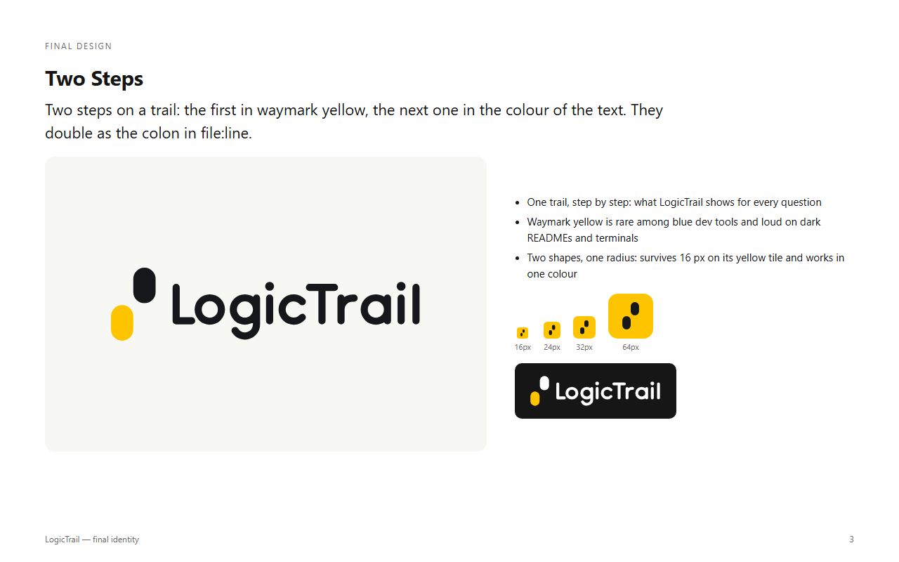
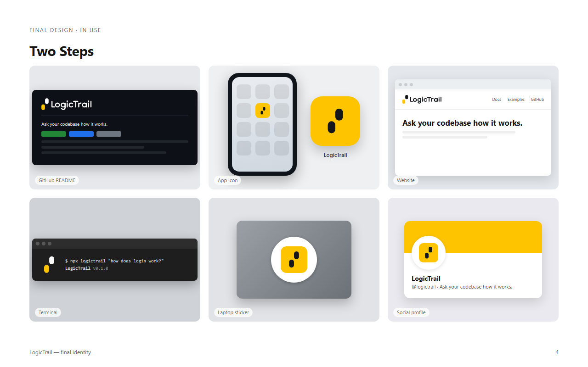

# LogicTrail logo



**Two Steps.** Two steps on a trail: the first in Waymark Yellow, the next in the colour of the text. LogicTrail shows the
path your code takes one step at a time, and the two steps also read as the colon in `file:line`.

## Files

Everything is in [`logo/`](logo) as SVG (outlined, no fonts), with PNG exports in [`png/`](png).

| Use                                          | File                                                                  |
| -------------------------------------------- | --------------------------------------------------------------------- |
| Logo on light backgrounds (default)          | `logictrail-horizontal.svg` · `logictrail-stacked.svg`                |
| Logo on dark backgrounds                     | `logictrail-horizontal-dark.svg` · `logictrail-stacked-dark.svg`      |
| One colour (yellow backgrounds, print, docs) | `…-ink.svg` · `…-black.svg` · `…-white.svg`                           |
| Symbol without the name                      | `logictrail-symbol.svg` · `logictrail-symbol-dark.svg` (+ one-colour) |
| Avatars, app icon, README badge              | `logictrail-icon.svg` (yellow tile)                                   |
| Favicons and anything under 24 px            | `logictrail-icon-small.svg` (redrawn on the 16 px grid)               |
| Name only                                    | `logictrail-wordmark.svg` · `-black` · `-white`                       |

The README uses [`../assets/logo.svg`](../assets/logo.svg) (the yellow tile). The viewer's header logo and favicon are the
small cut, inlined in `src/render/html.ts`.

## Colour

| Name           | HEX       | RGB         | CMYK                      | Pantone (approx.) |
| -------------- | --------- | ----------- | ------------------------- | ----------------- |
| Waymark Yellow | `#FFC400` | 255 196 0   | 0 23 100 0                | 7548 C            |
| Ink            | `#16171B` | 22 23 27    | 60 50 40 100 (rich black) | Black 6 C         |
| White          | `#FFFFFF` | 255 255 255 | 0 0 0 0                   | —                 |

- Ink on yellow is 11.2 : 1 and yellow on near-black is 12 : 1. Yellow on white is only 1.6 : 1, so **never use yellow on
  its own on a light background**, and never for text.
- The yellow step is always the first (lower-left) step. The second step and the name take the text colour: Ink on light,
  white on dark.

## Backgrounds

- **Light:** full colour (yellow + Ink) or one-colour Ink.
- **Dark:** `-dark` (yellow + white) or one-colour white. These files are drawn slightly thinner to offset the glow
  of light-on-dark.
- **Yellow:** one-colour Ink only.
- **Photos and busy backgrounds:** use the yellow tile.

## Clear space and minimum size

Keep a clear zone of **one step width** (the width of one pill in the symbol) on every side of the logo. It scales
with the logo.

| Version                 | Smallest on screen | Smallest in print |
| ----------------------- | ------------------ | ----------------- |
| Horizontal, full colour | 120 px wide        | 30 mm wide        |
| Horizontal, one colour  | 80 px wide         | 20 mm wide        |
| Symbol (no tile)        | 24 px tall         | 6 mm tall         |
| Yellow tile             | 16 px (small cut)  | 5 mm              |

## Don't

- Don't swap the colours of the steps, mirror or rotate the symbol: the steps always climb to the upper right.
- Don't type "LogicTrail" in a font next to the symbol. Use the lockup files; the letters are drawn, not typeset.
- Don't put the steps in another container than the yellow tile, or change the tile's corner radius.
- Don't add outlines, shadows, gradients or effects, or recolour outside the palette.
- Don't stretch, squash or rearrange the parts of a lockup.

## Type

The wordmark is custom-drawn and needs no font. For text next to the logo, use the system UI stack the viewer already
uses (`ui-sans-serif, system-ui, "Segoe UI", Roboto, …`) and its monospace stack for code.

## Web icons

[`web/`](web) has `favicon.ico` (16/32/48), `favicon.svg`, `apple-touch-icon.png`, `icon-192.png`, `icon-512.png`,
`maskable-512.png` and `site.webmanifest`:

```html
<link rel="icon" href="/favicon.ico" sizes="32x32" />
<link rel="icon" href="/favicon.svg" type="image/svg+xml" />
<link rel="apple-touch-icon" href="/apple-touch-icon.png" />
<link rel="manifest" href="/site.webmanifest" />
<meta name="theme-color" content="#16171B" />
```



## Notes

- No trademark search has been done. Run one (e.g. WIPO Global Brand Database, USPTO, Swissreg) before registering the
  name or mark.
- Pantone and CMYK values are approximations; check them against a physical swatch before printing.
